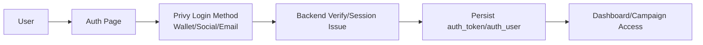
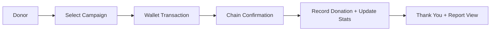
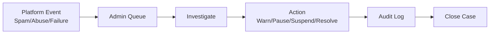

# FundLoom

FundLoom is a decentralized fundraising platform focused on transparent campaign creation and contribution tracking, with wallet-first onboarding and progressive Privy authentication (wallet, social, email).

> Scope note: this roadmap intentionally **excludes fiat contribution implementation** for now, per current product direction.

## Table of Contents
- [Vision](#vision)
- [Current State](#current-state)
- [Remaining Tasks (Production Readiness Backlog)](#remaining-tasks-production-readiness-backlog)
- [Architecture](#architecture)
- [Flow Diagrams](#flow-diagrams)
- [Admin Operations Scope](#admin-operations-scope)
- [Project Structure](#project-structure)
- [Environment Variables](#environment-variables)
- [Development](#development)
- [Production Docs](#production-docs)

## Vision
- Empower creators to launch verifiable campaigns.
- Allow donors to contribute via crypto rails with auditable outcomes.
- Provide admin tooling for moderation, incident response, and platform health.

## Current State
- Frontend: React + TypeScript + Vite.
- Auth: Privy runtime integration and wallet flow present, with backend-verified wallet session hardening in place.
- Data: campaign/donation/comment flows still partially backend-dependent.
- Admin: basic admin pages exist, but require production hardening and expanded operational tooling.

## Remaining Tasks (Production Readiness Backlog)

## Roadmap Execution Progress

- ✅ **Phase 1 (started): Security & Auth Hardening**
  - ✅ Backend-verified wallet session enforcement by default.
  - ✅ JWT startup validation (`/auth/me`) and stale-session clearing.
  - ✅ Token expiry/refresh scheduling hooks added on the client.
  - ✅ Auth audit event hooks added (best-effort API logging).
- ✅ **Phase 2 (in progress): Core Campaign Lifecycle**
  - ✅ Standardized backend→frontend lifecycle status mapping (`pending_review`, `active`, `paused`, `completed`, `archived`, `flagged`).
  - ✅ Added lifecycle-aware campaign filtering in campaigns page.
  - ✅ Tightened owner/admin controls for campaign image management actions and backend-safe update IDs.
  - ✅ Added campaign updates timeline ingestion + owner/admin posting flow on report page.
  - ✅ Added owner/admin lifecycle controls (pause, reactivate, archive) in campaign report workflow.
- 🔄 **Phase 3 (started): Onchain Contribution Reliability (Non-fiat)**
  - ✅ Added donation transaction state machine UX (`initiated`, `wallet_prompt`, `pending`, `confirmed`, `failed`) in donation modal flow.
  - ✅ Added explicit chain/network guardrails with guided wallet network switching to configured EVM chain before submit.
  - ✅ Added best-effort backend crypto donation reconciliation hook using tx hash after on-chain submission.
  - ✅ Wired frontend smart-contract interactions for `createCampaign` (optional toggle), `donate`, and token allowance checks.
- ⏳ Remaining Phase 3+ items pending.
- 🔄 **Phase 4 (started): Community & Trust**
  - ✅ Added discussion anti-spam controls (client-side suspicious-content checks, char limit, post cooldown).
  - ✅ Added campaign-level and comment-level abuse reporting actions wired to moderation API hooks.
- 🔄 **Phase 5 (started): Admin Features (Track + Resolve Platform Issues)**
  - ✅ Added admin incident snapshot cards (pending reviews, inactive campaigns, locked users, open reports).
  - ✅ Added admin moderation queue UI with resolve/reject case actions (backend endpoint-ready).
- ⏳ Remaining Phase 5+ items pending.
- 🔄 **Phase 6 (started): Observability, QA, and Release**
  - ✅ Added frontend blockchain/auth environment validation script (`npm run validate:env`).
- ⏳ Remaining Phase 6+ items pending.


### Phase 1 — Privy Auth + Session Integrity
- [ ] Complete production Privy integration for wallet/social/email sign-in and account linking.
- [ ] Enforce backend-issued sessions/JWTs for all auth providers with no insecure fallback in production.
- [ ] Add refresh/revocation/session-expiry controls and auth event telemetry.

### Phase 2 — Cost-Efficient Onchain Data Strategy
- [ ] Lock the onchain/offchain split so only verifiable financial state is stored onchain.
- [ ] Finalize backend-to-chain campaign ID mapping and verification checks in frontend.
- [ ] Keep rich content (descriptions/media/comments/moderation notes) offchain to reduce gas cost.

### Phase 3 — Campaign Lifecycle + Onchain Reliability (Non-fiat)
- [ ] Complete lifecycle parity across frontend/backend/contract.
- [ ] Add server-side tx state persistence and idempotent donation finalization.
- [ ] Add reconciliation/indexing for chain events with reorg-safe handling.
- [ ] Harden chain mismatch/retry UX for wallet transactions.

### Phase 4 — Community, Trust, and Moderation
- [ ] Move anti-spam/reporting policy to backend enforcement.
- [ ] Add full report workflow (open/triage/investigating/resolved/rejected).
- [ ] Add moderator notes/evidence and donor-facing transparency summaries.

### Phase 5 — Admin Operations
- [ ] Expand incident dashboard (auth, tx, moderation, reconciliation, API health).
- [ ] Add case assignment, SLA timers, escalation, and postmortem workflows.
- [ ] Add user/campaign risk controls with full audit history.

### Phase 6 — Observability, QA, and Release
- [ ] Structured logs + tracing across auth/campaign/donation/moderation flows.
- [ ] Uptime/error dashboards + alerting.
- [ ] E2E and security coverage for critical workflows.
- [ ] Release checklist + rollback runbook.

## Architecture

See full architecture in [`docs/ARCHITECTURE.md`](docs/ARCHITECTURE.md).

### High-Level Components
- **Frontend SPA**: routing, UI state, auth entry, campaign UX.
- **Auth Layer**: Privy runtime + backend verification/session issuance.
- **Backend API**: campaigns, donations, comments, admin controls.
- **Blockchain Layer**: transaction submission and confirmation.
- **Admin Control Plane**: moderation + issue resolution workflows.

## Flow Diagrams

### 1) Authentication Flow


### 2) Campaign Contribution Flow (Non-fiat)


### 3) Admin Issue Resolution Flow


## Admin Operations Scope

See [`docs/ADMIN_OPERATIONS.md`](docs/ADMIN_OPERATIONS.md) for:
- Incident tracking model
- Moderation SLA expectations
- Resolution workflow and audit requirements

## Project Structure

```txt
src/
  components/       UI components and feature widgets
  context/          Auth and app state providers
  lib/              API clients, runtime integrations, utilities
  pages/            Route-level pages
  services/         Service-layer logic
  types/            Shared TypeScript contracts
```

## Environment Variables

Use `.env.example` as template.

Important variables:
- `VITE_PRIVY_APP_ID`
- `VITE_PRIVY_JS_SDK_URL`
- `VITE_ALLOW_INSECURE_WALLET_SESSION` (dev-only fallback; keep `false` in production)
- `VITE_API_BASE_URL`
- `VITE_DEFAULT_CHAIN`
- `VITE_RPC_BASE_SEPOLIA`
- `VITE_RPC_BASE_MAINNET`
- `VITE_WALLETCONNECT_PROJECT_ID`
- `VITE_EVM_CONTRACT_ADDRESS`
- `VITE_EVM_CHAIN_ID_HEX`
- `VITE_ENABLE_ONCHAIN_CAMPAIGN_CREATE`
- `VITE_EVM_USDC_ADDRESS`
- `VITE_EVM_USDT_ADDRESS`

## Development

```bash
npm install
npm run validate:env
npm run dev
```

Production build:
```bash
npm run build
```


## Do I Really Need a Backend?

Short answer: **yes for production**, optional only for limited blockchain demos.

- Demo-only (no backend): wallet connect + contract calls can work, but auth/session hardening, moderation, reconciliation, and admin workflows are missing.
- Production: backend is required for Privy session bridge, abuse controls, offchain data, and operational reliability.

See [`docs/BACKEND_REQUIREMENTS.md`](docs/BACKEND_REQUIREMENTS.md) for the full decision matrix.

## Production Docs
- Architecture: [`docs/ARCHITECTURE.md`](docs/ARCHITECTURE.md)
- Backend requirements matrix: [`docs/BACKEND_REQUIREMENTS.md`](docs/BACKEND_REQUIREMENTS.md)
- Delivery roadmap: [`docs/ROADMAP.md`](docs/ROADMAP.md)
- Admin operations: [`docs/ADMIN_OPERATIONS.md`](docs/ADMIN_OPERATIONS.md)
- Deployment guide: [`docs/DEPLOYMENT.md`](docs/DEPLOYMENT.md)
- Security policy: [`docs/SECURITY.md`](docs/SECURITY.md)
- Contributing guide: [`docs/CONTRIBUTING.md`](docs/CONTRIBUTING.md)
- License: [`LICENSE`](LICENSE)
