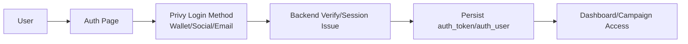
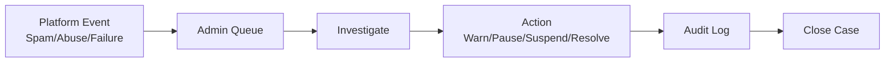

# FundLoom

FundLoom is a decentralized fundraising platform focused on transparent campaign creation and contribution tracking, with wallet-first onboarding and progressive Privy authentication (wallet, social, email).

> Scope note: this roadmap intentionally **excludes fiat contribution implementation** for now, per current product direction.

## Table of Contents
- [Vision](#vision)
- [Current State](#current-state)
- [Remaining Tasks (Production Readiness Backlog)](#remaining-tasks-production-readiness-backlog)
- [Architecture](#architecture)
- [Flow Diagrams](#flow-diagrams)
- [Admin Operations Scope](#admin-operations-scope)
- [Project Structure](#project-structure)
- [Environment Variables](#environment-variables)
- [Development](#development)
- [Production Docs](#production-docs)

## Vision
- Empower creators to launch verifiable campaigns.
- Allow donors to contribute via crypto rails with auditable outcomes.
- Provide admin tooling for moderation, incident response, and platform health.

## Current State
- Frontend: React + TypeScript + Vite.
- Auth: Privy runtime integration and wallet flow present, with backend-verified wallet session hardening in place.
- Data: campaign/donation/comment flows still partially backend-dependent.
- Admin: basic admin pages exist, but require production hardening and expanded operational tooling.

## Remaining Tasks (Production Readiness Backlog)

## Roadmap Execution Progress

- ✅ **Phase 1 (started): Security & Auth Hardening**
  - ✅ Backend-verified wallet session enforcement by default.
  - ✅ JWT startup validation (`/auth/me`) and stale-session clearing.
  - ✅ Token expiry/refresh scheduling hooks added on the client.
  - ✅ Auth audit event hooks added (best-effort API logging).
- ✅ **Phase 2 (in progress): Core Campaign Lifecycle**
  - ✅ Standardized backend→frontend lifecycle status mapping (`pending_review`, `active`, `paused`, `completed`, `archived`, `flagged`).
  - ✅ Added lifecycle-aware campaign filtering in campaigns page.
  - ✅ Tightened owner/admin controls for campaign image management actions and backend-safe update IDs.
  - ✅ Added campaign updates timeline ingestion + owner/admin posting flow on report page.
  - ✅ Added owner/admin lifecycle controls (pause, reactivate, archive) in campaign report workflow.
- 🔄 **Phase 3 (started): Onchain Contribution Reliability (Non-fiat)**
  - ✅ Added donation transaction state machine UX (`initiated`, `wallet_prompt`, `pending`, `confirmed`, `failed`) in donation modal flow.
  - ✅ Added explicit chain/network guardrails with guided wallet network switching to configured EVM chain before submit.
  - ✅ Added best-effort backend crypto donation reconciliation hook using tx hash after on-chain submission.
- ⏳ Remaining Phase 3+ items pending.
- 🔄 **Phase 4 (started): Community & Trust**
  - ✅ Added discussion anti-spam controls (client-side suspicious-content checks, char limit, post cooldown).
  - ✅ Added campaign-level and comment-level abuse reporting actions wired to moderation API hooks.
- ⏳ Remaining Phase 4+ items pending.


### Phase 1 — Security & Auth Hardening
- [ ] Enforce server-issued session tokens for **all** auth paths (wallet/social/email) and disable insecure fallback in production.
- [ ] Add refresh-token rotation / session expiry policies.
- [ ] Add explicit CSRF/session protection strategy for web auth surfaces.
- [ ] Add auth audit logging (sign-in, sign-out, failures, lockouts).

### Phase 2 — Core Campaign Lifecycle
- [ ] Finalize campaign CRUD ownership checks and moderation states.
- [ ] Standardize backend-to-frontend campaign schema (IDs, status, evm metadata, verification state).
- [ ] Add campaign updates/timeline posts with moderation support.
- [ ] Add campaign archival/deactivation workflows.

### Phase 3 — Onchain Contribution Reliability (Non-fiat)
- [ ] Implement robust chain/network guardrails and chain switch UX.
- [ ] Add transaction state machine (initiated/pending/confirmed/failed).
- [ ] Add event indexing/reconciliation service for donation finalization.
- [ ] Add idempotent donation recording and replay handling.

### Phase 4 — Community & Trust
- [ ] Production-grade comments/discussions with anti-spam controls.
- [ ] Report/resolve workflows for abuse and fraudulent campaigns.
- [ ] Campaign transparency reports and donor-facing audit summaries.

### Phase 5 — Admin Features (Track + Resolve Platform Issues)
- [ ] Admin incident dashboard (auth failures, tx failures, moderation queue, API health).
- [ ] Admin case management (open, triage, assign, resolve, postmortem).
- [ ] User risk actions (warn/limit/suspend/reinstate) with full audit logs.
- [ ] Campaign risk controls (flag, pause, re-verify, remove) with reason tracking.

### Phase 6 — Observability, QA, and Release
- [ ] Add structured logging + request tracing across auth/campaign/donation flows.
- [ ] Add uptime/error dashboards + alerting.
- [ ] Add E2E coverage for auth, create campaign, donate, and admin workflows.
- [ ] Add release checklist + rollback runbook.

## Architecture

See full architecture in [`docs/ARCHITECTURE.md`](docs/ARCHITECTURE.md).

### High-Level Components
- **Frontend SPA**: routing, UI state, auth entry, campaign UX.
- **Auth Layer**: Privy runtime + backend verification/session issuance.
- **Backend API**: campaigns, donations, comments, admin controls.
- **Blockchain Layer**: transaction submission and confirmation.
- **Admin Control Plane**: moderation + issue resolution workflows.

## Flow Diagrams

### 1) Authentication Flow


A modern single-page application that showcases charity campaigns, accepts donations, displays leaderboards and comments, and provides a polished UX with modals and theming.

## 🔐 Authentication Direction (Privy-first)

This project is now moving to **wallet-first authentication without requiring backend auth endpoints**.

- Wallet login now verifies signed messages client-side and creates a local session.
- The next step is wiring this same flow to Privy SDK (`VITE_PRIVY_APP_ID`) for production-grade auth + embedded wallet UX.
- Legacy JWT endpoints can remain optional/fallback while contract and onchain flows mature.

### 3) Admin Issue Resolution Flow


## Admin Operations Scope

See [`docs/ADMIN_OPERATIONS.md`](docs/ADMIN_OPERATIONS.md) for:
- Incident tracking model
- Moderation SLA expectations
- Resolution workflow and audit requirements

## Project Structure

```txt
src/
  components/       UI components and feature widgets
  context/          Auth and app state providers
  lib/              API clients, runtime integrations, utilities
  pages/            Route-level pages
  services/         Service-layer logic
  types/            Shared TypeScript contracts
```

## Environment Variables

Use `.env.example` as template.

Important variables:
- `VITE_PRIVY_APP_ID`
- `VITE_PRIVY_JS_SDK_URL`
- `VITE_ALLOW_INSECURE_WALLET_SESSION` (dev-only fallback; keep `false` in production)
- `VITE_API_BASE_URL`
- `VITE_DEFAULT_CHAIN`
- `VITE_RPC_BASE_SEPOLIA`
- `VITE_RPC_BASE_MAINNET`
- `VITE_WALLETCONNECT_PROJECT_ID`

Note: In production, IDs will be strings (MongoDB ObjectIds). The UI handles numeric IDs today due to localStorage seed data.

## 💾 State Management & Persistence

- Global state is managed in `src/context/AppContext.tsx`.
- Seed data arrays are loaded on first run and then persisted to `localStorage` under keys:
  - `cc_campaigns_v1`
  - `cc_donations_v1`
  - `cc_comments_v1`

## 🔀 Routing & Deep Links

- Main navigation tabs: campaigns, donate, charity, profile.
- If the URL contains `?campaign=<id>`, the Donation modal auto-opens on mount.

## 🧪 UX Flows

- Create Campaign: Opens modal, preview image, basic client-side validation, stores to localStorage.
- Donate: Opens modal, capture amount/message/method, simulates processing for non-crypto, updates state + shows thank-you.
- Comment: Adds a comment to the selected campaign and persists to localStorage.


## 🧭 What Privy Can and Cannot Replace

For your decentralized fundraising model (crypto + fiat), Privy is a great fit for identity and wallet UX, but not a full backend replacement by itself.

### Great fit for Privy / onchain
- User sign-in (wallet, email/social if enabled in Privy).
- Wallet management and signing UX.
- Onchain donation flows (Base / Base Sepolia, and other EVM networks).

### Still recommended offchain services (light backend or managed services)
- Fiat payment processing (Stripe/Paystack/Ramp/etc.) + webhook verification.
- Receipt history and searchable analytics dashboards.
- Abuse prevention/moderation (spam comments, campaign reports).
- Notification workflows (email receipts, campaign updates).

> Short version: **Privy can replace most auth backend work**, but fiat and operational workflows still need offchain infrastructure.

## 🔗 Intended Backend API Contract

When connected to a backend, the UI expects REST endpoints to support these flows. Base URL example: `http://localhost:5000/api/v1`.

### Auth
- POST `/auth/register`
- POST `/auth/login`
- GET `/auth/me`
- POST `/auth/logout`
- POST `/auth/forgot-password`
- POST `/auth/reset-password`
- POST `/auth/connect-wallet`
- POST `/auth/disconnect-wallet`

### Campaigns
- GET `/campaigns` — list with filters and pagination
- GET `/campaigns/:id`
- POST `/campaigns` — create (auth required)
- PUT `/campaigns/:id` — update (creator only)
- DELETE `/campaigns/:id` — delete (creator only)
- GET `/campaigns/user/:userId` — campaigns by user
- POST `/campaigns/:id/updates` — add update (creator)
- GET `/campaigns/stats/overview`

### Donations
- POST `/donations` — create (auth required)
- GET `/donations/campaign/:campaignId`
- GET `/donations/my-donations` — current user
- GET `/donations/:id`
- GET `/donations/stats/overview`
- GET `/donations/leaderboard`

### Comments
- GET `/comments/campaign/:campaignId`
- POST `/comments/campaign/:campaignId` — create (auth required)
- PUT `/comments/:id` — update (author)
- DELETE `/comments/:id` — delete (author)
- POST `/comments/:id/like` — like/unlike
- POST `/comments/:id/report` — report
- GET `/comments/my-comments`

### Users
- GET `/users/:id`
- PUT `/users/profile`
- POST `/users/avatar`
- GET `/users/dashboard`
- GET `/users` — admin
- PUT `/users/:id/role` — admin
- PUT `/users/:id/verify` — admin
- DELETE `/users/account`

## 🛠️ Development

### Prerequisites
- Node.js 18+

### Install & Run

```bash
npm install
npm run dev
```

Production build:
```bash
npm run build
```

Built with ❤️ using React, Vite, and Tailwind.
