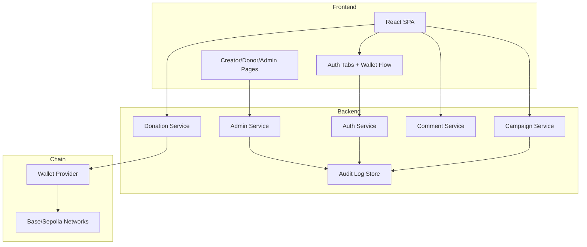

# FundLoom Architecture

## 1. System Context
FundLoom is a web client + backend + blockchain hybrid system.

- Frontend provides campaign UX, auth entry, and donor interactions.
- Backend provides policy enforcement, admin workflows, moderation, and analytics APIs.
- Blockchain provides contribution settlement and immutable transaction records.

## 2. Logical Layers

1. **Presentation Layer**
   - React SPA, route guards, modals, dashboards.
2. **Authentication Layer**
   - Privy runtime login (wallet/social/email).
   - Backend token verification and session issuance.
3. **Domain Layer**
   - Campaign lifecycle
   - Contribution lifecycle (non-fiat)
   - Community discussions
4. **Operations Layer**
   - Admin moderation
   - Incident/case tracking
   - Audit logging
5. **Infrastructure Layer**
   - API hosting
   - Indexing / reconciliation
   - Monitoring + alerting

## 3. Reference Component Diagram

## 4. Production Constraints
- No insecure local session fallback in production.
- All privileged actions must be attributable and auditable.
- Donation records must be idempotent and reconcile with chain data.
- Admin actions must have reason codes and immutable logs.
